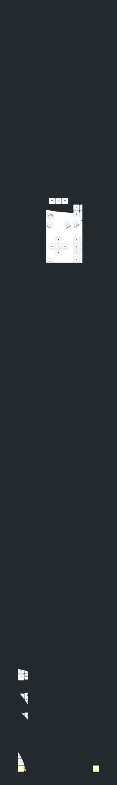

# Eyelash Sofle ZMK

This is the ZMK configuration for my [Eyelash Sofle](https://github.com/a741725193/zmk-sofle) keyboard with [SuperMini MCU boards](https://github.com/joric/nrfmicro/wiki/Alternatives#supermini-nrf52840) and nice!view compatible displays.

The keymap implements my [Colemax-Maxtend](https://github.com/mhantsch/maxtend) configuration.

This config supports [ZMK Studio](https://github.com/zmkfirmware/zmk-studio).

## About the Sofle keyboard

A columnar stagger, split, 64 keys keyboard forked from [Eyelash Sofle](https://github.com/a741725193/zmk-sofle). Variants are available with a clickable roller on the left half and an arrow key thumb stick on the right half. Nice!nano displays are also an option.

The particular Sofle variant that I purchased does not have the arrow key stick, nor the extra key for the clickable roller. These are still configured in the keymap, even if the physical keys do not exist on my keyboard. My variant comes with nice!nano displays and RGB backlight, though.

## Keymap Diagram

